---
## Front matter
title: "Лабораторная работа №4 "
subtitle: "Создание и процесс
обработки программ на языке ассемблера NASM"
author: "Селиванов Вячеслав Алексеевич"

## Generic otions
lang: ru-RU
toc-title: "Содержание"

## Bibliography
bibliography: bib/cite.bib
csl: pandoc/csl/gost-r-7-0-5-2008-numeric.csl

## Pdf output format
toc: true # Table of contents
toc-depth: 2
lof: true # List of figures
lot: true # List of tables
fontsize: 12pt
linestretch: 1.5
papersize: a4
documentclass: scrreprt
## I18n polyglossia
polyglossia-lang:
  name: russian
  options:
	- spelling=modern
	- babelshorthands=true
polyglossia-otherlangs:
  name: english
## I18n babel
babel-lang: russian
babel-otherlangs: english
## Fonts
mainfont: PT Serif
romanfont: PT Serif
sansfont: PT Sans
monofont: PT Mono
mainfontoptions: Ligatures=TeX
romanfontoptions: Ligatures=TeX
sansfontoptions: Ligatures=TeX,Scale=MatchLowercase
monofontoptions: Scale=MatchLowercase,Scale=0.9
## Biblatex
biblatex: true
biblio-style: "gost-numeric"
biblatexoptions:
  - parentracker=true
  - backend=biber
  - hyperref=auto
  - language=auto
  - autolang=other*
  - citestyle=gost-numeric
## Pandoc-crossref LaTeX customization
figureTitle: "Рис."
tableTitle: "Таблица"
listingTitle: "Листинг"
lofTitle: "Список иллюстраций"
lotTitle: "Список таблиц"
lolTitle: "Листинги"
## Misc options
indent: true
header-includes:
  - \usepackage{indentfirst}
  - \usepackage{float} # keep figures where there are in the text
  - \floatplacement{figure}{H} # keep figures where there are in the text
---

# Цель работы
Освоение процедуры компиляции и сборки программ, написанных на ассемблере NASM.

# Задание

    Создание программы Hello world!
    Работа с транслятором NASM
    Работа с расширенным синтаксисом командной строки NASM
    Работа с компоновщиком LD
    Запуск исполняемого файла
    Выполнение заданий для самостоятельной работы.

# Теоретическое введение

Основными функциональными элементами любой электронно-вычислительной машины
(ЭВМ) являются центральный процессор, память и периферийные устройства (рис. 4.1).
Взаимодействие этих устройств осуществляется через общую шину, к которой они подклю-
чены. Физически шина представляет собой большое количество проводников, соединяющих
устройства друг с другом. В современных компьютерах проводники выполнены в виде элек-
тропроводящих дорожек на материнской (системной) плате.
Основной задачей процессора является обработка информации, а также организация
координации всех узлов компьютера. В состав центрального процессора (ЦП) входят
следующие устройства:
• арифметико-логическое устройство (АЛУ) — выполняет логические и арифметиче-
ские действия, необходимые для обработки информации, хранящейся в памяти;
• устройство управления (УУ) — обеспечивает управление и контроль всех устройств
компьютера;
• регистры — сверхбыстрая оперативная память небольшого объёма, входящая в со-
став процессора, для временного хранения промежуточных результатов выполнения
инструкций; регистры процессора делятся на два типа: регистры общего назначения и
специальные регистры.

# Выполнение лабораторной работы
## Создание программы Hello world!
Создаю пустой текстовый файл hello.asm(рис. @fig:001).

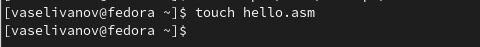{#fig:001 width=70%}

Открываю файл в текстовом редакторе gedit(рис. @fig:002).

{#fig:002 width=70%}

Заполняю файл, заполняю программу для вывода Hello world (рис. @fig:003).

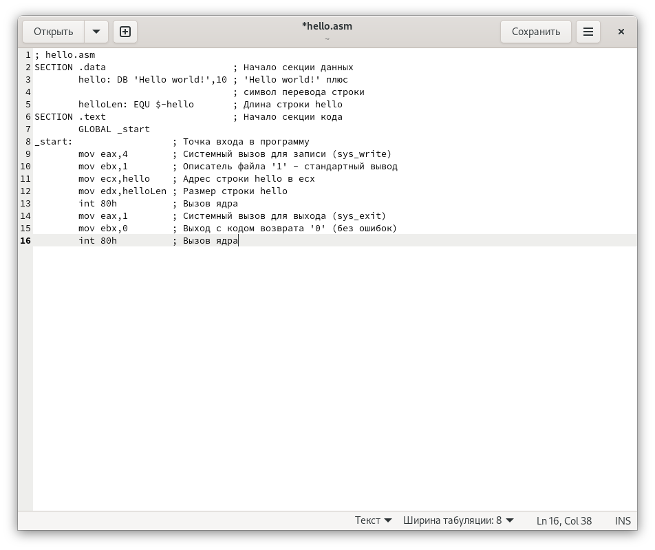{#fig:004 width=70%}

## Работа с транслятором NASM.
Превращаю текст программы для вывода "Hello world!" в объектный код с помощью транслятора NASM, используя команду nasm -f elf hello.asm, ключ -f указывает транслятору nasm, что требуется создать бинарный файл в формате ELF и с помощью утилиты ls проверяю создан ли файл hello.o (рис. @fig:004).

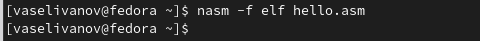{#fig:004 width=70%}

C помощью утилиты ls проверяю создан ли файл hello.o (рис. @fig:005).

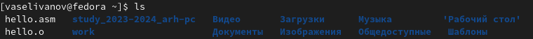{#fig:005 width=70%}

##Работа с расширенным синтаксисом командной строки NASM.
Ввожу команду, которая скомпилирует файл hello.asm в файл obj.o, при этом в файл будут включены символы для отладки (ключ -g), также с помощью ключа -l будет создан файл листинга list.lst. (рис. @fig:006).

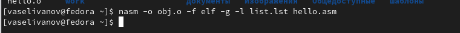{#fig:006 width=70%}

C помощью утилиты ls проверяю создан ли файл obj.o и list.lst (рис. @fig:007).

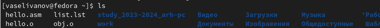{#fig:007 width=70%}

## Работа с компоновщиком LD.
Передаю объектный файл hello.o на обработку компоновщику LD, чтобы получить исполняемый файл hello.  Ключ -о задает имя создаваемого исполняемого файла. Далее проверяю с помощью утилиты ls правильность выполнения команды. (рис. @fig:008).

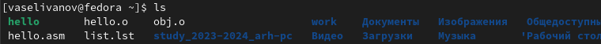{#fig:008 width=70%}

Выполняю следующую команду  Исполняемый файл будет иметь имя main, т.к. после ключа -о было задано значение main. Объектный файл, из которого собран этот исполняемый файл, имеет имя obj.o. (рис. @fig:009). 

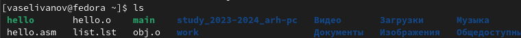{#fig:009 width=70%}

## Запуск исполняемого файла.
Запускаю созданный файл, чтобы проверить программу. (рис. @fig:010).

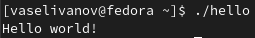{#fig:010 width=70%}

## Выполнение заданий для самостоятельной работы.
Создаю копию файла, называю его lab04.asm. (рис. @fig:011)

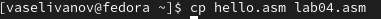{#fig:011 width=70%}

С помощью текстового редактора gedit открываю файл lab04.asm и меняю программу так, чтобы она выводила мои имя и фамилию.(рис. @fig:012)

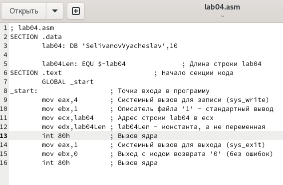{#fig:012 width=70%}

Компилирую текст программы в объектный файл.Проверяю с помощью утилиты ls, что файл lab04.o создан.(рис. @fig:011)

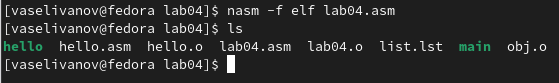{#fig:013 width=70%}

Передаю объектный файл lab04.o на обработку компоновщику LD, чтобы получить исполняемый файл lab04.(рис. @fig:014)

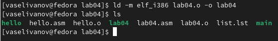{#fig:014 width=70%}

Запускаю исполняемый файл lab04, на экран действительно выводятся мои имя и фамилия.(рис. @fig:015)  

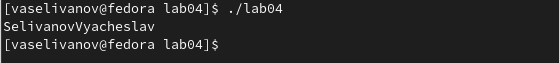{#fig:015 width=70%}

Скидываю файлы hello.asm и lab04.asm в каталог 4 лабораторный работы.(рис. @fig:016)

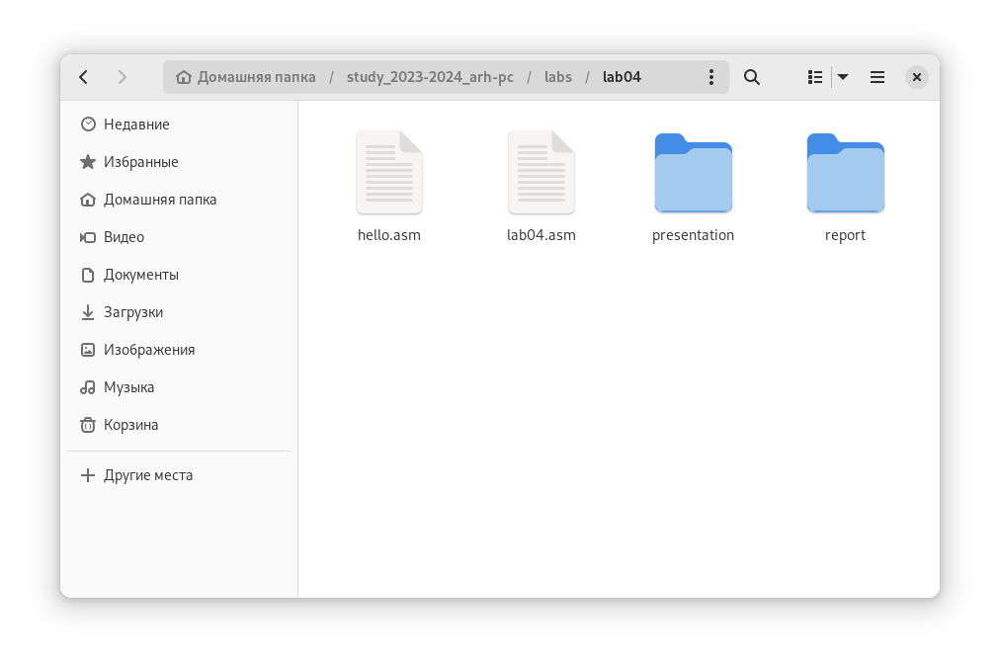{#fig:016 width=70%}

Отправление всех изменений на github.  (рис. @fig:017)

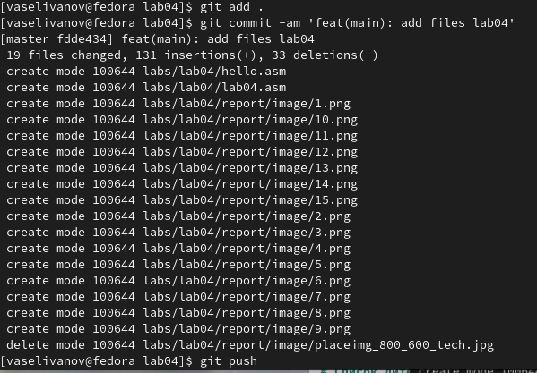{#fig:017 width=70%}

# Выводы

При выполнении данной лабораторной работы я освоила процедуры компиляции и сборки программ, написанных на ассемблере NASM.

# Список литературы{.unnumbered}

 (1Архитектура ЭВМ)
