---
## Front matter
title: "Лабораторная работа №4"
subtitle: "Основы работы с Midnight Commander (mc). Структура программы наязыке ассемблера NASM. Системные вызовы в ОС GNU Linux"
author: "Селиванов Вячеслав Алексеевич"

## Generic otions
lang: ru-RU
toc-title: "Содержание"

## Bibliography
bibliography: bib/cite.bib
csl: pandoc/csl/gost-r-7-0-5-2008-numeric.csl

## Pdf output format
toc: true # Table of contents
toc-depth: 2
lof: true # List of figures
lot: true # List of tables
fontsize: 12pt
linestretch: 1.5
papersize: a4
documentclass: scrreprt
## I18n polyglossia
polyglossia-lang:
  name: russian
  options:
	- spelling=modern
	- babelshorthands=true
polyglossia-otherlangs:
  name: english
## I18n babel
babel-lang: russian
babel-otherlangs: english
## Fonts
mainfont: PT Serif
romanfont: PT Serif
sansfont: PT Sans
monofont: PT Mono
mainfontoptions: Ligatures=TeX
romanfontoptions: Ligatures=TeX
sansfontoptions: Ligatures=TeX,Scale=MatchLowercase
monofontoptions: Scale=MatchLowercase,Scale=0.9
## Biblatex
biblatex: true
biblio-style: "gost-numeric"
biblatexoptions:
  - parentracker=true
  - backend=biber
  - hyperref=auto
  - language=auto
  - autolang=other*
  - citestyle=gost-numeric
## Pandoc-crossref LaTeX customization
figureTitle: "Рис."
tableTitle: "Таблица"
listingTitle: "Листинг"
lofTitle: "Список иллюстраций"
lotTitle: "Список таблиц"
lolTitle: "Листинги"
## Misc options
indent: true
header-includes:
  - \usepackage{indentfirst}
  - \usepackage{float} # keep figures where there are in the text
  - \floatplacement{figure}{H} # keep figures where there are in the text
---

# Цель работы
Приобретение практических навыков работы в Midnight Commander. Освоение инструкций
языка ассемблера mov и int

# Задание
    Основы работы с NASM
    Структура программы на языке ассемблера NASM
    Подключение внешнего файла
    Выполнение заданий для самостоятельной работы


# Теоретическое введение
Программа на языке ассемблера NASM, как правило, состоит из трёх секций: секция кода
программы (SECTION .text), секция инициированных (известных во время компиляции)
данных (SECTION .data) и секция неинициализированных данных (тех, под которые во
время компиляции только отводится память, а значение присваивается в ходе выполнения
программы) (SECTION .bss). Для объявления инициированных данных в секции .data используются директивы DB, DW,
DD, DQ и DT, которые резервируют память и указывают, какие значения должны храниться в
этой памяти:
• DB (define byte) — определяет переменную размером в 1 байт;
• DW (define word) — определяет переменную размеров в 2 байта (слово);
• DD (define double word) — определяет переменную размером в 4 байта (двойное слово);
• DQ (define quad word) — определяет переменную размером в 8 байт (учетверённое слово);
• DT (define ten bytes) — определяет переменную размером в 10 байт.


# Выполнение лабораторной работы
## Основы работы с NASM.

Открываю Midnight Commander, используя команду mc(рис. [-@fig:001]).

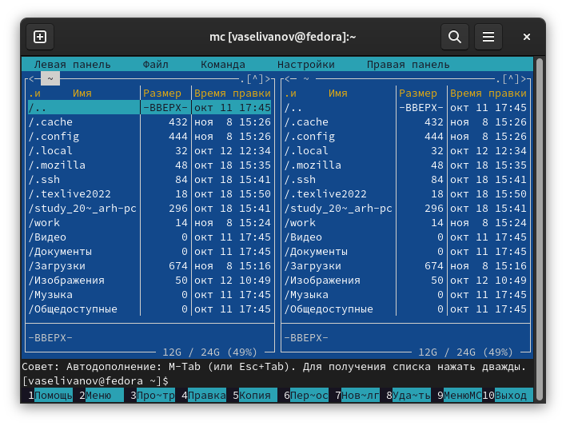{#fig:001 width=70%}

Перехожу в каталог work,созданный при выполнении предыдущей лабораторной работы(рис. [-@fig:002]).

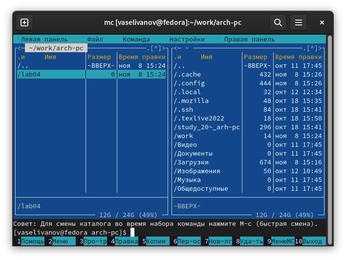{#fig:002 width=70%}

Создаю новый каталог lab05(рис. [-@fig:003]).

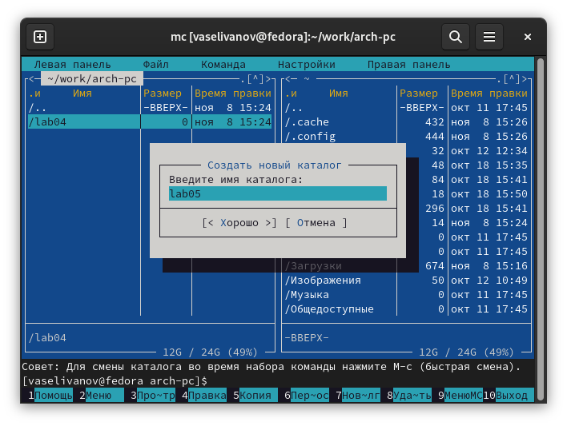{#fig:003 width=70%}

В новом каталоге создаю файл lab5-1.asm,в котором я буду работать далее, используя команду touch(рис. [-@fig:004]).

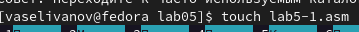{#fig:004 width=70%}

## Структура программы на языке ассемблера NASM.

С помощью клавиши F4 открываю созданный файл в редакторе nano(рис. [-@fig:005]).

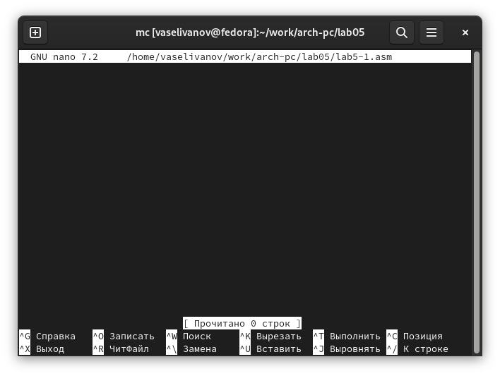{#fig:005 width=70%}

Ввожу в файл код программы для запроса строки(рис. [-@fig:006]). Далее выхожу из редактора,сохраняя изменения.

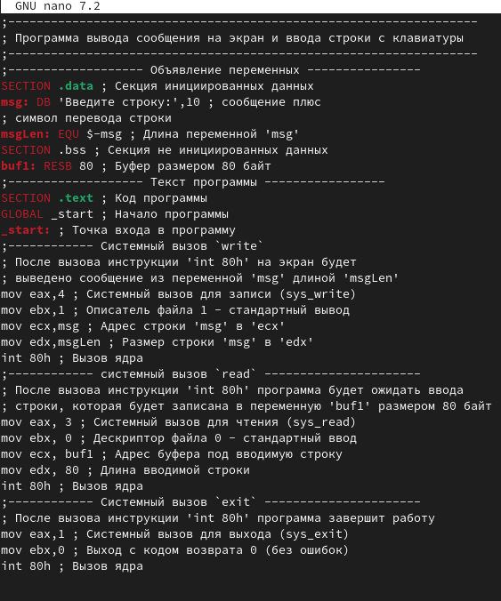{#fig:006 width=70%}

Используя клавишу F4, открываю файл для просмотра,чтобы проверить,сохранилась ли в нем написанная программа(рис. [-@fig:007]).

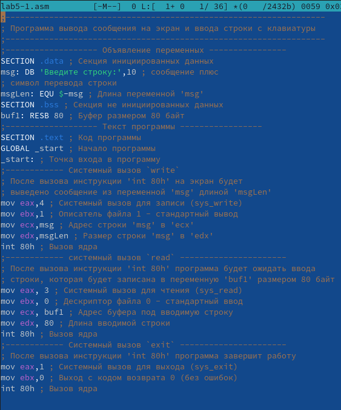{#fig:007 width=70%}

Создаю для текста программы объектный файл. Выполняю его компоновку(рис. [-@fig:008]) (рис. [-@fig:009]). После чего создался исполняемый файл lab5-1.

{#fig:008 width=70%}

{#fig:009 width=70%}

Запускаю исполняемый файл. Программа выводит строку и ждет ввода с клавиатуры, после ввода своего ФИО программа завершает работу(рис. [-@fig:010]).

{#fig:010 width=70%}

## Подключенние внешнего файла.

Скачиваю файл in_out.asm со страницы ТУИС. Файл сохранился в 'Загрузки'(рис. [-@fig:011]). 

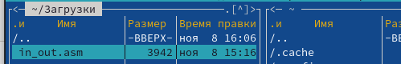{#fig:011 width=70%}

Копирую данный файл в каталог lab05, используя клавишу F5(рис. [-@fig:012]). 

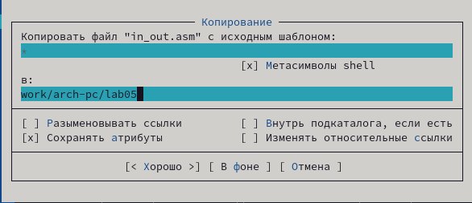{#fig:012 width=70%}

С помощью той же утилиты F5 копирую файл lab5-1.asm, но уже с другим названием(рис. [-@fig:013]). 

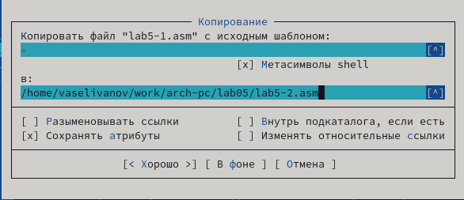{#fig:013 width=70%}

Меняю содержимое файла lab5-2.asm в редакторе nano, чтобы в программе использовались подпрограммы из внешнего файла in_out.asm(рис. [-@fig:014]).

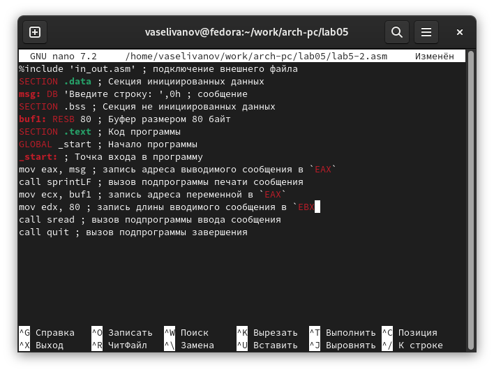{#fig:014 width=70%}
 
Создаю объектный файл для lab5-2.asm(рис. [-@fig:015]).

{#fig:015 width=70%}

Компоную данный файл,после чего создается исполняемый файл. Запускаю его и проверяю,работает ли данная программа(рис. [-@fig:016]).

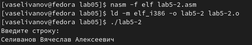{#fig:016 width=70%}

Открываю файл lab5-2.asm для редактирования в nano,используя F4. Изменяю в нем подпрограмму sprintLF на sprint, сохраняю изменения и открываю файл для проверки(рис. [-@fig:017]).

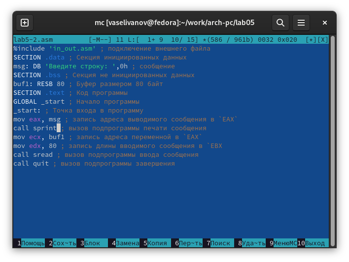{#fig:017 width=70%}

Выполняю компоновку объектного файла и запускаю новый исполняемый файл(рис. [-@fig:018]).

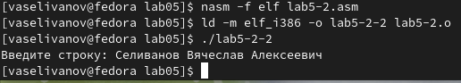{#fig:018 width=70%}

Вся разница заключается в том, что запуск с подпрограммой sprintLF запрашивает воод с новой строки, а исполняемый файл с подпрограммой sprint просит ввод без переноса но новую строчку.


## Выполнение заданий для самостоятельной работы.

Создаю копию файла lab5-1.asmс именем lab5-1-1.asm с помощью клавиши F5(рис. [-@fig:019]).

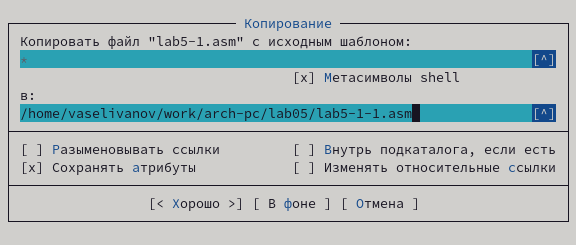{#fig:019 width=70%}

Используя клавишу F4 открываю данный файл в nano и редактирую файл так,чтобы кроме вывода приглашения и запроса ввода, она выводила строку,которую пользователь ввел с клавиатуры(рис. [-@fig:020]).

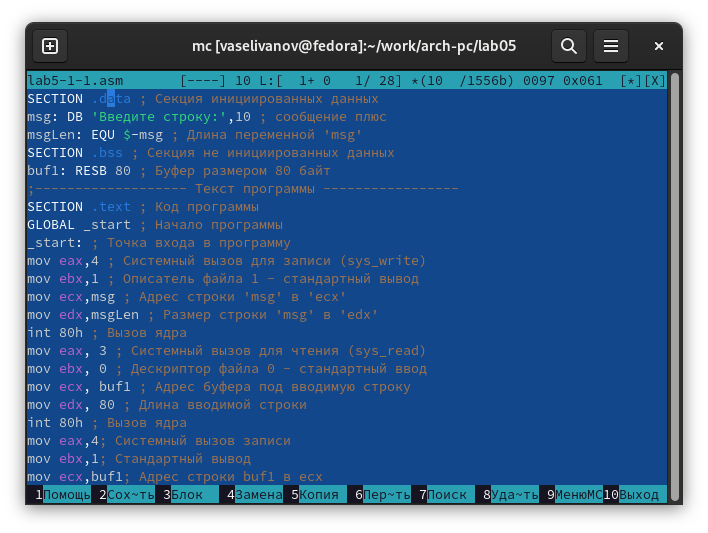{#fig:020 width=70%}

``` NASM
SECTION .data ; Секция инициированных данных
msg: DB 'Введите строку:',10 ; сообщение плюс
msgLen: EQU $-msg ; Длина переменной 'msg'
SECTION .bss ; Секция не инициированных данных
buf1: RESB 80 ; Буфер размером 80 байт
;------------------- Текст программы -----------------
SECTION .text ; Код программы
GLOBAL _start ; Начало программы
_start: ; Точка входа в программу
mov eax,4 ; Системный вызов для записи (sys_write)
mov ebx,1 ; Описатель файла 1 - стандартный вывод
mov ecx,msg ; Адрес строки 'msg' в 'ecx'
mov edx,msgLen ; Размер строки 'msg' в 'edx'
int 80h ; Вызов ядра
mov eax, 3 ; Системный вызов для чтения (sys_read)
mov ebx, 0 ; Дескриптор файла 0 - стандартный ввод
mov ecx, buf1 ; Адрес буфера под вводимую строку
mov edx, 80 ; Длина вводимой строки
int 80h ; Вызов ядра
mov eax,4; Системный вызов записи
mov ebx,1; Стандартный вывод
mov ecx,buf1; Адрес строки buf1 в ecx
mov edx,buf1; Размер строки
int 80h; Вызов ядра
mov eax,1 ; Системный вызов для выхода (sys_exit)
mov ebx,0 ; Выход с кодом возврата 0 (без ошибок)
int 80h ; Вызов ядра
```
Создаю объектный файл lab5-1-1.o и обрабатываю его,используя компоновщик,запускаю созданный исполняемый файл, ввожу своё имя, после этого программа выводит то,что я напечатал(рис. [-@fig:021]).

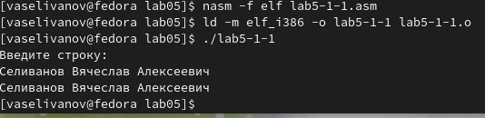{#fig:021 width=70%}

Копирую файл lab5-2.asm,используя F5,  переименовываю его в lab5-2-3.asm(рис. [-@fig:022]).

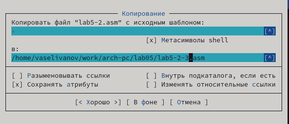{#fig:022 width=70%}

Используя клавишу F4 открываю данный файл в nano и редактирую файл так,чтобы кроме вывода приглашения и запроса ввода, она выводила строку,которую пользователь ввел с клавиатуры

```NASM
%include 'in_out.asm' ; подключение внешнего файла
SECTION .data ; Секция инициированных данных
msg: DB 'Введите строку: ',0h ; сообщение
SECTION .bss ; Секция не инициированных данных
buf1: RESB 80 ; Буфер размером 80 байт
SECTION .text ; Код программы
GLOBAL _start ; Начало программы
_start: ; Точка входа в программу
mov eax, msg ; запись адреса выводимого сообщения в `EAX`
call sprint ; вызов подпрограммы печати сообщения
mov ecx, buf1 ; запись адреса переменной в `EAX`
mov edx, 80 ; запись длины вводимого сообщения в `EBX`
call sread; вызов ввода сообщения
mov eax,4; Системный вызов для записи (sys-write)
mov ebx,1; Стандартный вывод
mov ecx,buf1; Адрес строки в buf1 для ecx
int 80h; Вызов ядра
call quit ; вызов подпрограммы завершения
```
Создаю объектный файл lab5-2-3.o и обрабатываю его,используя компоновщик,запускаю созданный исполняемый файл, ввожу своё имя, после этого программа выводит то,что я напечатал(рис. [-@fig:023]).

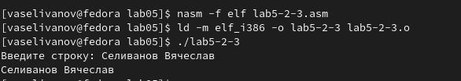{#fig:023 width=70%}


 


# Выводы
При выполнении данной работы я приобрел навыки работы с Midnight Commander, а также освоил инструкции языка ассемблера mov и int.


# Список литературы{.unnumbered}

::: {#Лабораторная работа №5}
:::
