---
## Front matter
title: "Лабораторная работа №6."
subtitle: "Арифметические операции в NASM."
author: "Селиванов Вячеслав Алексеевич"

## Generic otions
lang: ru-RU
toc-title: "Содержание"

## Bibliography
bibliography: bib/cite.bib
csl: pandoc/csl/gost-r-7-0-5-2008-numeric.csl

## Pdf output format
toc: true # Table of contents
toc-depth: 2
lof: true # List of figures
lot: true # List of tables
fontsize: 12pt
linestretch: 1.5
papersize: a4
documentclass: scrreprt
## I18n polyglossia
polyglossia-lang:
  name: russian
  options:
	- spelling=modern
	- babelshorthands=true
polyglossia-otherlangs:
  name: english
## I18n babel
babel-lang: russian
babel-otherlangs: english
## Fonts
mainfont: PT Serif
romanfont: PT Serif
sansfont: PT Sans
monofont: PT Mono
mainfontoptions: Ligatures=TeX
romanfontoptions: Ligatures=TeX
sansfontoptions: Ligatures=TeX,Scale=MatchLowercase
monofontoptions: Scale=MatchLowercase,Scale=0.9
## Biblatex
biblatex: true
biblio-style: "gost-numeric"
biblatexoptions:
  - parentracker=true
  - backend=biber
  - hyperref=auto
  - language=auto
  - autolang=other*
  - citestyle=gost-numeric
## Pandoc-crossref LaTeX customization
figureTitle: "Рис."
tableTitle: "Таблица"
listingTitle: "Листинг"
lofTitle: "Список иллюстраций"
lolTitle: "Листинги"
## Misc options
indent: true
header-includes:
  - \usepackage{indentfirst}
  - \usepackage{float} # keep figures where there are in the text
  - \floatplacement{figure}{H} # keep figures where there are in the text
---

# Цель работы
Освоение арифметических инструкций языка ассемблера NASM.


# Задание
Символьные и численные данные в NASM
Выполнение арифметических операций в NASM
Задания для самостоятельной работы

# Теоретическое введение

Большинство инструкций на языке ассемблера требуют обработки операндов. Адрес опе-
ранда предоставляет место, где хранятся данные, подлежащие обработке. Это могут быть
данные хранящиеся в регистре или в ячейке памяти. Далее рассмотрены все существующие
способы задания адреса хранения операндов – способы адресации.
Существует три основных способа адресации:
• Регистровая адресация – операнды хранятся в регистрах и в команде используются
имена этих регистров, например: mov ax,bx.
• Непосредственная адресация – значение операнда задается непосредственно в ко-
манде, Например: mov ax,2.
• Адресация памяти – операнд задает адрес в памяти. В команде указывается символи-
ческое обозначение ячейки памяти, над содержимым которой требуется выполнить
операцию.


# Выполнение лабораторной работы
## Символьные и численные данные в NASM

 С помощью команды mkdir создаю новую директорию,в которой буду создавать файлы с программами во время всей лабораторной работы №6 (рис. @fig:001). Перехожу в созданный каталог

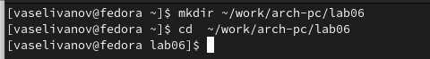{#fig:001 width=70%}

Создаю файл lab6-1.asm,используя команду"touch" (рис. @fig:002).

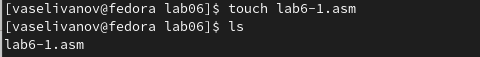{#fig:002 width=70%}

Копирую в созданный каталог файл in_out.asm,потому что он будет использоваться и в других программах (рис. @fig:003).

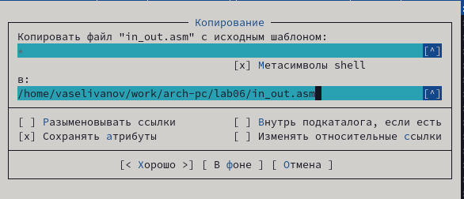{#fig:003 width=70%}

Открываю файл lab6-1.asm в nano и вставляю в него программу ввода значения регистра eax (рис. @fig:004).

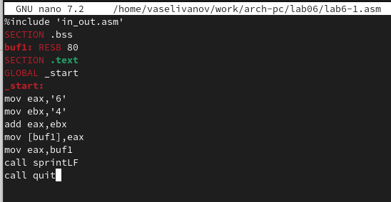{#fig:004 width=70%}

``` NASM
%include 'in_out.asm'
SECTION .bss
buf1: RESB 80
SECTION .text
GLOBAL _start
_start:
mov eax,'6'
mov ebx,'4'
add eax,ebx
mov [buf1],eax
mov eax,buf1
call sprintLF
call quit
```

Создаю объектный файл и после его компановки запускаю программу (рис. @fig:005). Программа выводит символ "j",потому что программа вывела символ,которые соответствует в системе ASCII сумме двоичных символов 4 и 6.

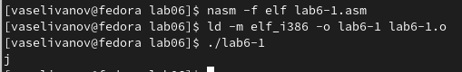{#fig:005 width=70%}

Теперь изменяю в тексте программы символы '6' и '4' на цифры 6 и 4 (рис. @fig:006).

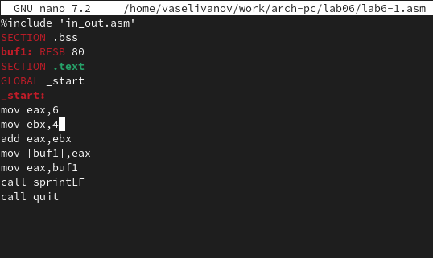{#fig:006 width=70%}

```NASM
%include 'in_out.asm'
SECTION .bss
buf1: RESB 80
SECTION .text
GLOBAL _start
_start:
mov eax,6
mov ebx,4
add eax,ebx
mov [buf1],eax
mov eax,buf1
call sprintLF
call quit
```
Создаю новый исполняемый файл и запускаю программу (рис. @fig:007). Теперь у меня выводится символ с кодом 10,это символ перевода строки, он не отображается при выводе на экран.

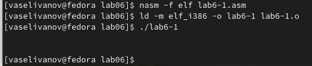{#fig:007 width=70%}

Создаю новый файл под названием lab6-2.asm и проверяю его наличие, используя ls (рис. @fig:008).

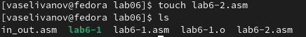{#fig:008 width=70%}

Ввожу в файл текст уже другой программы для вывода eax (рис. @fig:009).

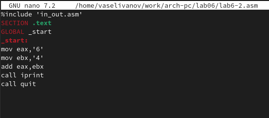{#fig:009 width=70%}

```NASM
%include 'in_out.asm'
SECTION .text
GLOBAL _start
_start:
mov eax,'6'
mov ebx,'4'
add eax,ebx
call iprint
call quit
```
Создаю и запускаю исполняемый файл lab6-2 (рис. @fig:010).Теперь программа выводит 106,потому что программа выводит именно число,не символ, хотя всё еще происходит сложение кодов символов "6" и "4".

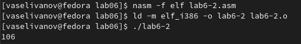{#fig:010 width=70%}

Заменяю в текста данной программы символы '4' и '6' на числа 6 и 4 (рис. @fig:011).

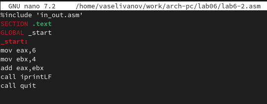{#fig:011 width=70%}

```Nasm
%include 'in_out.asm'
SECTION .text
GLOBAL _start
_start:
mov eax,6
mov ebx,4
add eax,ebx
call iprintLF
call quit
```
Снова создаю исполняемый файл программы lab6-2 (рис. @fig:012). Теперь программа складывает именно  числа,поэтому выводом является сумма 4+6,которая равна 10.

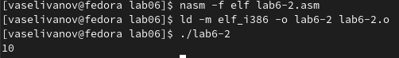{#fig:012 width=70%}

Заменяю в тексте программы функцию iprintLF на iprint (рис. @fig:013).

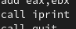{#fig:013 width=70%}

Создаю и запускаю исполняемый файл (рис. @fig:014). После завершение программы меня не перебрасывает на следующую строку а оставляет на той же.

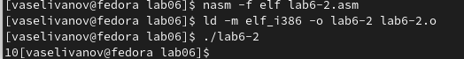{#fig:014 width=70%}

## Выполнение арифметических операций в NASM

Создаю файл,называю его lab6-3.asm, используя команду touch (рис. @fig:015).

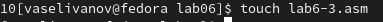{#fig:015 width=70%}

Ввожу в созданный файл текст программы для вычисления значения выражения f(x)=(5*2+3)/3 (рис. @fig:016).

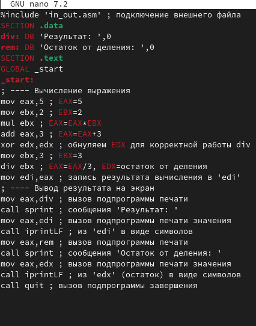{#fig:016 width=70%}

Запускаю созданный исполняемый файл (рис. @fig:017).

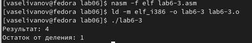{#fig:017 width=70%}

Изменяю программу так,чтобы она вычисляла другое выражение-f(x)=(4*6+2)/5 (рис. @fig:018).

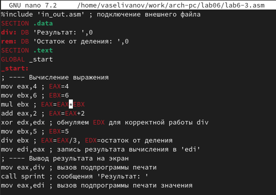{#fig:018 width=70%}

```NASM
%include 'in_out.asm' ; подключение внешнего файла
SECTION .data
div: DB 'Результат: ',0
rem: DB 'Остаток от деления: ',0
SECTION .text
GLOBAL _start
_start:
; ---- Вычисление выражения
mov eax,4 ; EAX=4
mov ebx,6 ; EBX=6
mul ebx ; EAX=EAX*EBX
add eax,2 ; EAX=EAX+2
xor edx,edx ; обнуляем EDX для корректной работы div
mov ebx,5 ; EBX=5
div ebx ; EAX=EAX/5, EDX=остаток от деления
mov edi,eax ; запись результата вычисления в 'edi'
; ---- Вывод результата на экран
mov eax,div ; вызов подпрограммы печати
call sprint ; сообщения 'Результат: '
mov eax,edi ; вызов подпрограммы печати значения
call iprintLF ; из 'edi' в виде символов
mov eax,rem ; вызов подпрограммы печати
call sprint ; сообщения 'Остаток от деления: '
mov eax,edx ; вызов подпрограммы печати значения
call iprintLF ; из 'edx' (остаток) в виде символов
call quit ; вызов подпрограммы завершени
```
Создаю исполняемый файл и запускаю программу (рис. @fig:019). Программа посчитала выражение абсолютно верно.

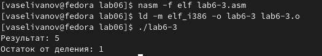{#fig:019 width=70%}

Создаю новый файл variant.asm (рис. @fig:020).

{#fig:020 width=70%}

Ввожу в файл текст программы,который вычисляет задания по номеру студенческого билета (рис. @fig:021).

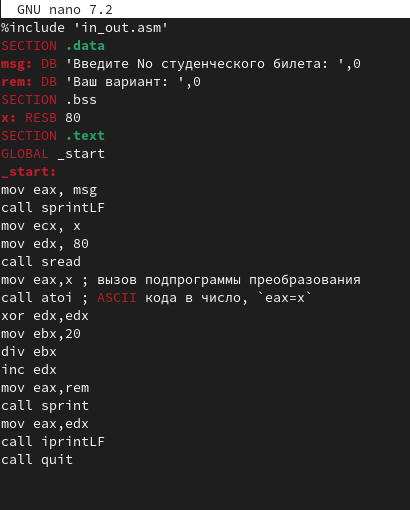{#fig:021 width=70%}

Создаю исполняемый файл и запускаю программу (рис. @fig:022). Ввожу номер своего студенческого. Программа вывела,что мой вариант№12.

{#fig:022 width=70%}

### Ответы на вопросы
1. За вывод сообщения "Ваш вариант" отвечают строчки кода
```NASM
mov eax,rem
call sprint
```

2. Инструкция mov ес, х используется, чтобы положить адрес вводимой строки х в регистр есх mov edx, 80 - запись в регистр edx длины вводимой строки call sread - вызов подпрограммы из внешнего файла, обеспечивающей ввод сообщения с клавиатуры
7. За вывод на экран результатов вычислений отвечают строки:
3. call atoi используется для вызова подпрограммы из внешнего файла, которая преобразует ascii-код символа в целое число и записывает результат в регистр eax

4. За вычисления варианта отвечают строки:
```NASM
хот edx,edx ; обнуление еах для корректной работы div
mov ebx, 20 ; ebx = 20
div ebx; eax = eax/20, edx - остаток от деления
inc edx; edx = edx + 1
```

5. При выполнении инструкции div ebx остаток от деления записывается в регистр edx

6. Инструкция inc edx увеличивает значение регистра edx на 1

7. За вывод на экран результатов вычислений отвечают строки:
```NASM
mov eax,edx
call iprintLF
```

## Задания для самостоятельной работы
Создаю файл lab6-4.asm,используя команду touch (рис. @fig:023).

{#fig:023 width=70%}

Открываю файл, ввожу в него для вычисления выражения,которое мне выпало (№8) (11 + x) * 2 - 6  (рис. @fig:024).

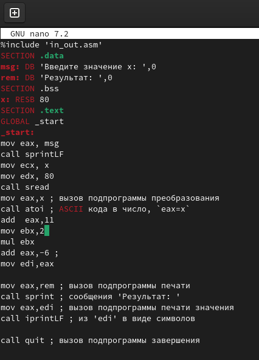{#fig:024 width=70%}

```NASM
%include 'in_out.asm'
SECTION .data
msg: DB 'Введите значение x: ',0
rem: DB 'Результат: ',0
SECTION .bss
x: RESB 80
SECTION .text
GLOBAL _start
_start:
mov eax, msg
call sprintLF
mov ecx, x
mov edx, 80
call sread
mov eax,x ; вызов подпрограммы преобразования
call atoi ; ASCII кода в число, `eax=x`
add  eax,11
mov ebx,2 
mul ebx
add eax,-6 ;
mov edi,eax

mov eax,rem ; вызов подпрограммы печати
call sprint ; сообщения 'Результат: '
mov eax,edi ; вызов подпрограммы печати значения
call iprintLF ; из 'edi' в виде символов

call quit ; вызов подпрограммы завершения
```
Создаю исполняемый файл и запускаю программу (рис. @fig:025). Программа выдает правильный ответ.

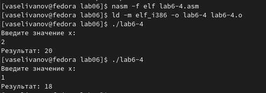{#fig:025 width=70%}


# Выводы

При выполнении данной лабораторной работы я освоил арифметические инструкции языка ассемблера NASM.

# Список литературы{.unnumbered}

1. Лабораторная работа №6
2. Таблица ASCII
