---
## Front matter
title: "Лабораторная работа №7"
subtitle: " Команды безусловного и
условного переходов в Nasm. Программирование
ветвлений."
author: "Селиванов Вячеслав Алексеевич"

## Generic otions
lang: ru-RU
toc-title: "Содержание"

## Bibliography
bibliography: bib/cite.bib
csl: pandoc/csl/gost-r-7-0-5-2008-numeric.csl

## Pdf output format
toc: true # Table of contents
toc-depth: 2
lof: true # List of figures
lot: true # List of tables
fontsize: 12pt
linestretch: 1.5
papersize: a4
documentclass: scrreprt
## I18n polyglossia
polyglossia-lang:
  name: russian
  options:
	- spelling=modern
	- babelshorthands=true
polyglossia-otherlangs:
  name: english
## I18n babel
babel-lang: russian
babel-otherlangs: english
## Fonts
mainfont: PT Serif
romanfont: PT Serif
sansfont: PT Sans
monofont: PT Mono
mainfontoptions: Ligatures=TeX
romanfontoptions: Ligatures=TeX
sansfontoptions: Ligatures=TeX,Scale=MatchLowercase
monofontoptions: Scale=MatchLowercase,Scale=0.9
## Biblatex
biblatex: true
biblio-style: "gost-numeric"
biblatexoptions:
  - parentracker=true
  - backend=biber
  - hyperref=auto
  - language=auto
  - autolang=other*
  - citestyle=gost-numeric
## Pandoc-crossref LaTeX customization
figureTitle: "Рис."
tableTitle: "Таблица"
listingTitle: "Листинг"
lofTitle: "Список иллюстраций"
lolTitle: "Листинги"
## Misc options
indent: true
header-includes:
  - \usepackage{indentfirst}
  - \usepackage{float} # keep figures where there are in the text
  - \floatplacement{figure}{H} # keep figures where there are in the text
---

# Цель работы

Изучение команд условного и безусловного переходов. Приобретение навыков написания
программ с использованием переходов. Знакомство с назначением и структурой файла
листинга.

# Задание

1.Реализация переходов в NASM
2.Изучение структуры файлов листинга
3.Задания для самостоятельной работы

# Теоретическое введение
Для реализации ветвлений в ассемблере используются так называемые команды передачи
управления или команды перехода. Можно выделить 2 типа переходов:
• условный переход – выполнение или не выполнение перехода в определенную точку
программы в зависимости от проверки условия.
• безусловный переход – выполнение передачи управления в определенную точку про-
граммы без каких-либо условий.
Адрес перехода может быть либо меткой, либо адресом области памяти, в которую предва-
рительно помещен указатель перехода. Кроме того, в качестве операнда можно использовать
имя регистра, в таком случае переход будет осуществляться по адресу, хранящемуся в этом
регистре.
Флаг – это бит, принимающий значение 1 («флаг установлен»), если выполнено некоторое
условие, и значение 0 («флаг сброшен») в противном случае. Флаги работают независимо
друг от друга, и лишь для удобства они помещены в единый регистр — регистр флагов, отра-
жающий текущее состояние процессора.
Инструкция cmp является одной из инструкций, которая позволяет сравнить операнды и
выставляет флаги в зависимости от результата сравнения.
Инструкция cmp является командой сравнения двух операндов и имеет такой же формат,
как и команда вычитания

# Выполнение лабораторной работы
## Реализация переходов в NASM
Для начала работы создаю директорию lab07 в каталоге,в котором работал на протяжении предыдущих работ. После чего создаю новый файл lab7-1.asm, чтобы далее записать в него код программы (рис. @fig:001).

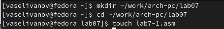{#fig:001 width=70%}

Не забываю также скопировать в созданный каталог файл in_out.asm, так как далее он будет использоваться во всех программах (рис. @fig:002).

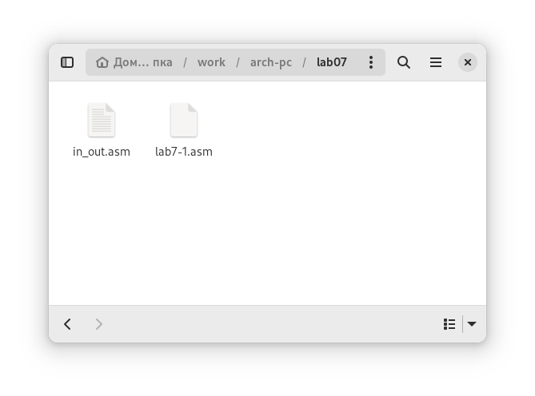{#fig:002 width=70%}

Открываю файл lab7-1.asm в GNU nano и вставляю теккст программы из листинга 1 (рис. @fig:003).

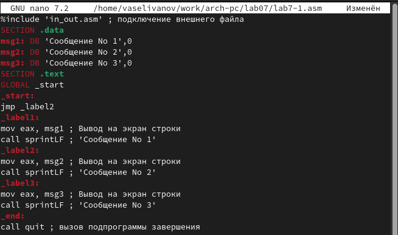{#fig:003 width=70%}


После чего я создаю объектный файл программы,кампаную его и запускаю код (рис. @fig:004). Благодаря команде jmp программа сразу перепрыгивает ко второму действию,игнорируя первый этап кода.

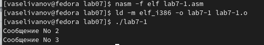{#fig:004 width=70%}

Далее я изменяю текст программы в соответствии с листингом 2 (рис. @fig:005).

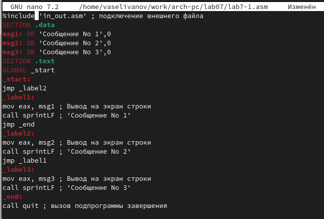{#fig:005 width=70%}

Кампаную созданный объектный файл и запускаю программу (рис. @fig:006). Теперь программа с самого начала перепрыгивает ко второму участку кода,после чего (из-за той же команды jmp) переходит к первому участку,где и заканчивает свою работу.

{#fig:006 width=70%}

Редактирую код программы в соответствии с заданием: сначала выводится "Сообщение №3", затем "Сообщение №2", затем "Сообщение №1", для этого я использую всё ту же команду jmp (рис. @fig:007).

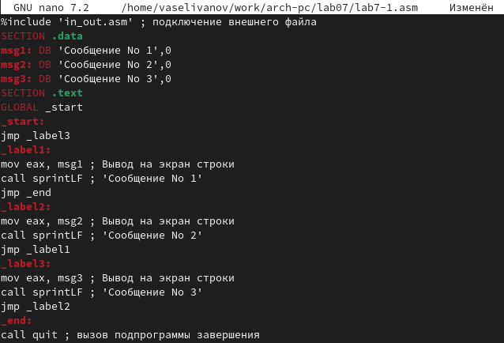{#fig:007  width=70%}

```Nasm
%include 'in_out.asm' ; подключение внешнего файла
SECTION .data
msg1: DB 'Сообщение No 1',0
msg2: DB 'Сообщение No 2',0
msg3: DB 'Сообщение No 3',0
SECTION .text
GLOBAL _start
_start:
jmp _label3
_label1:
mov eax, msg1 ; Вывод на экран строки
call sprintLF ; 'Сообщение No 1'
jmp _end
_label2:
mov eax, msg2 ; Вывод на экран строки
call sprintLF ; 'Сообщение No 2'
jmp _label1
_label3:
mov eax, msg3 ; Вывод на экран строки
call sprintLF ; 'Сообщение No 3'
jmp _label2
_end:
call quit ; вызов подпрограммы завершения
```
Запускаю программу и проверяю правильность написания программы (рис. @fig:008). После запуска программа выёт результат в правильном порядке.

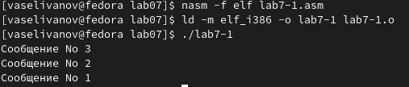{#fig:008 width=70%}

Чтобы писать следующий код, создаю новый файл lab7-2.asm,используя утилиту touch (рис. @fig:009).

{#fig:009 width=70%}

Вставляю в созданный файл текст кода,скопировав листинг 7.3 (рис. @fig:010). Данная программа позволяет находить наибольшее число из двух констант и одного произвольного числа.

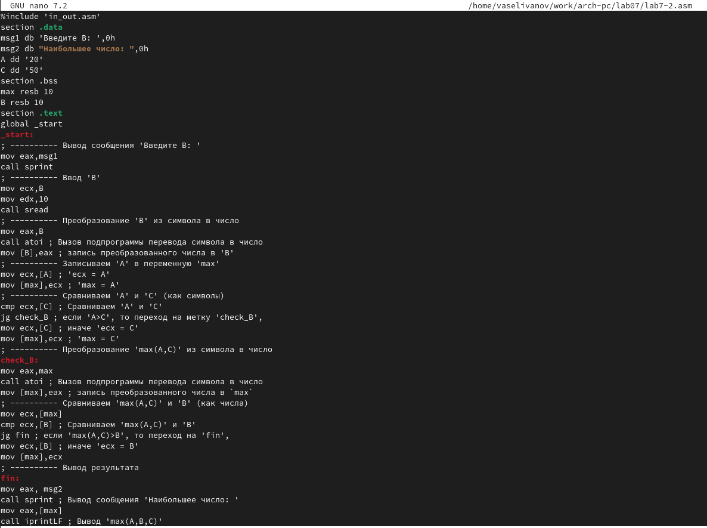{#fig:010 width=70%}

Запускаю код дважды, в первый раз я ввожу число,которое меньше одной из констант, а во второй-больше (рис. @fig:011).В обоих случаях программа выдает наибольшее из трёх чисел.

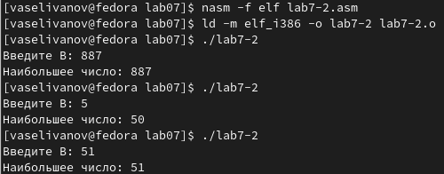{#fig:011 width=70%}

## Изучение структуры файлов листинга
Создаю файл листинга для lab7-2.asm (рис. @fig:012).

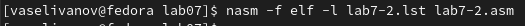{#fig:012 width=70%}

Открываю созданный файл с помощью mcedit,используя команду "mcedit lab7-2.lst" (рис. @fig:013).

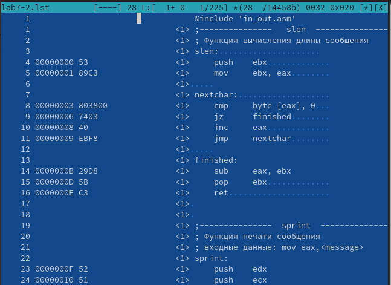{#fig:013 width=70%}

Первая строка,которую я хочу подробно описать,является строка №5 (рис. @fig:014). Первое число в строке(самое левое) как раз и указывает на номер строки, после чего мы можем увидеть адрес данной строки (00000001), далее у нас идет машинный код,в который ассемблируется инструкция.То есть инструкция "mov ebx,eax" ассемблируется в 89С3. В данном случае, 89С3-это инструкция на машинном языке по вызову и присваиванию регистра. После этого(в правой части) мы можем увидеть исходный текст программы.

{#fig:014 width=70%}

Вторая строка,которую я хочу подробно описать,является строка №11 (рис. @fig:015). Первое число в строке(самое левое) как раз и указывает на номер строки, после чего мы можем увидеть адрес данной строки (00000009), далее у нас идет машинный код,в который ассемблируется инструкция.То есть инструкция "jmp nextchar" ассемблируется в EBF8. В данном случае, EBF8-это инструкция на машинном языке по переходу на другую строку. После этого(в правой части) мы можем увидеть исходный текст программы.

{#fig:015 width=70%}

Третья строка,которую я хочу подробно описать,является строка №39 (рис. @fig:016). Первое число в строке(самое левое) как раз и указывает на номер строки, после чего мы можем увидеть адрес данной строки (00000145), далее у нас идет машинный код,в который ассемблируется инструкция.То есть инструкция "cmp ecx" ассемблируется в 380D. В данном случае, 380D-это инструкция на машинном языке по сравнению чисел. В квадратных скобках рядом можно увидеть адрес,который указывает на значение числа B. После этого(в правой части) мы можем увидеть исходный текст программы.

{#fig:016 width=70%}

Далее я открыл файл с программой lab7-2.asm и в инструкции с двумя операндами удалил один из них (рис. @fig:017).

{#fig:017 width=70%}

Выполняю трансляцию с получением файла листинга (рис. @fig:018). Транслятор выводит ошибку при ассемблировании,даже указывая на номер строки, и файл листинга не создается.

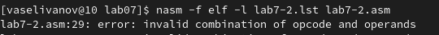{#fig:018 width=70%}

## Задания для самостоятельной работы
Создаю файл,в котором буду делать первое самостоятельное задание (рис. @fig:019).

{#fig:019 width=70%}

В лабораторной работе №6 мне выпал 12 вариант,именно его я и буду выполнять, мне выпали числа 52,33,40. Пишу программу,которая выбирает наименьшее число из трех заданных чисел.С начала выбираю меньшее из A и B, а после сравниваю его с C (рис. @fig:020). 

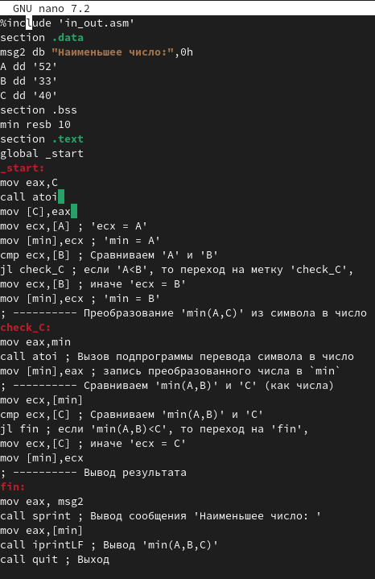{#fig:020 width=70%}

```NASM
%include 'in_out.asm'
section .data
msg2 db "Наименьшее число:",0h
A dd '52'
B dd '40'
C dd '33'
section .bss
min resb 10
section .text
global _start
_start:
mov eax,C
call atoi 
mov [C],eax 
mov ecx,[A] ; 'ecx = A'
mov [min],ecx ; 'min = A'
cmp ecx,[B] ; Сравниваем 'A' и 'B'
jl check_C ; если 'A<B', то переход на метку 'check_C',
mov ecx,[B] ; иначе 'ecx = B'
mov [min],ecx ; 'min = B'
; ---------- Преобразование 'min(A,C)' из символа в число
check_C:
mov eax,min
call atoi ; Вызов подпрограммы перевода символа в число
mov [min],eax ; запись преобразованного числа в `min`
; ---------- Сравниваем 'min(A,B)' и 'C' (как числа)
mov ecx,[min]
cmp ecx,[C] ; Сравниваем 'min(A,B)' и 'C'
jl fin ; если 'min(A,B)<C', то переход на 'fin',
mov ecx,[C] ; иначе 'ecx = C'
mov [min],ecx
; ---------- Вывод результата
fin:
mov eax, msg2
call sprint ; Вывод сообщения 'Наименьшее число: '
mov eax,[min]
call iprintLF ; Вывод 'min(A,B,C)'
call quit ; Выход
```

Запускаю исполняемый, проверяю ответ и убеждаюсь,что программа выдает наименьшее из трёх чисел (рис. @fig:021).

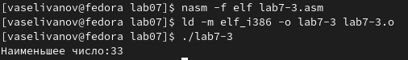{#fig:021 width=70%}

Для следующего задания создаю ещё один файл lab7-4.asm (рис. @fig:022).

{#fig:022 width=70%}

Пишу программу по заданию 8 варианта (рис. @fig:023). Прошу на вводу x и a, после чего преобразую их из символов в числа, сравниваю а с 3 и в зависимости от значения x выполняю действия (либо 3*a либо x+1)

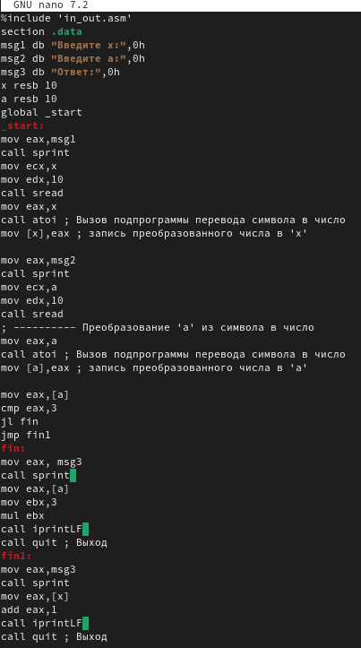{#fig:023 width=70%}

```
NASM
%include 'in_out.asm'
section .data
msg1 db "Введите x:",0h
msg2 db "Введите a:",0h
msg3 db "Ответ:",0h
x resb 10
a resb 10
global _start
_start:
mov eax,msg1
call sprint
mov ecx,x
mov edx,10
call sread
mov eax,x
call atoi ; Вызов подпрограммы перевода символа в число
mov [x],eax ; запись преобразованного числа в 'x'

mov eax,msg2
call sprint
mov ecx,a
mov edx,10
call sread
; ---------- Преобразование 'a' из символа в число
mov eax,a
call atoi ; Вызов подпрограммы перевода символа в число
mov [a],eax ; запись преобразованного числа в 'a'

mov eax,[a]
cmp eax,3
jl fin
jmp fin1
fin:
mov eax, msg3
call sprint 
mov eax,[a]
mov ebx,3
mul ebx
call iprintLF 
call quit ; Выход
fin1:
mov eax,msg3
call sprint
mov eax,[x]
add eax,1
call iprintLF 
call quit ; Выход
```
Создаю объектный файл (рис. @fig:024).

{#fig:024 width=70%}

Компаную и запускаю исполняемый файл,вводя числа для первой проверки: x=1,a=4 (рис. @fig:025). Программа выдает нужный ответ 2.

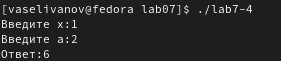{#fig:025 width=70%}


# Выводы

В этой работе я научился работать с переходами в NASM, разобрался со структурой листинговых файлов и научился применять эти знания для написания программ.

# Список литературы

Лабораторная работа №7.
